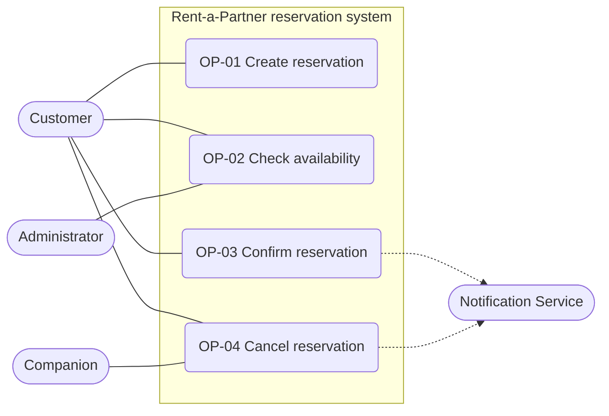
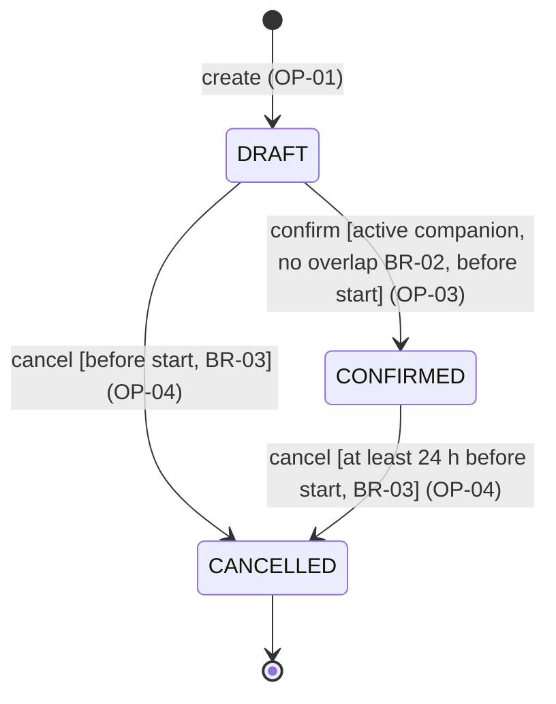
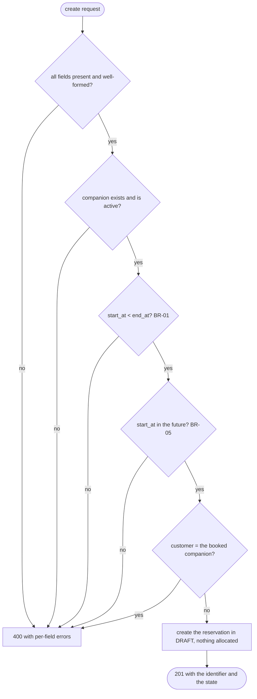
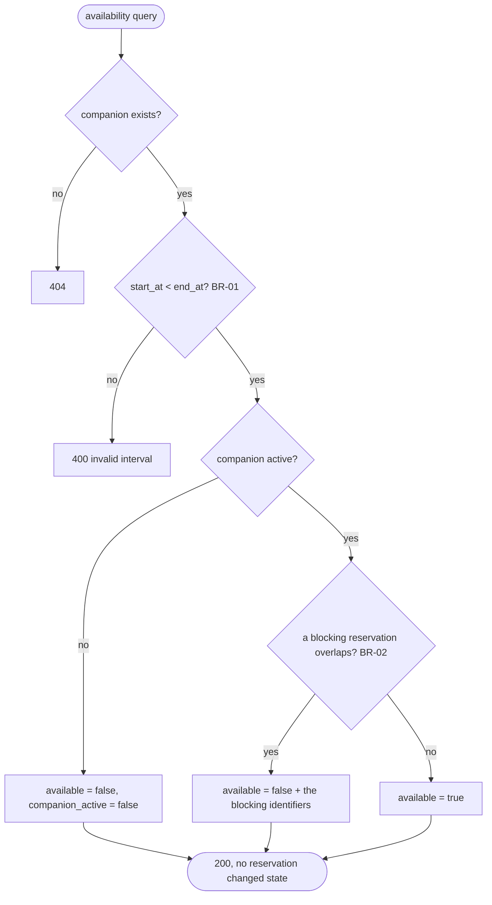
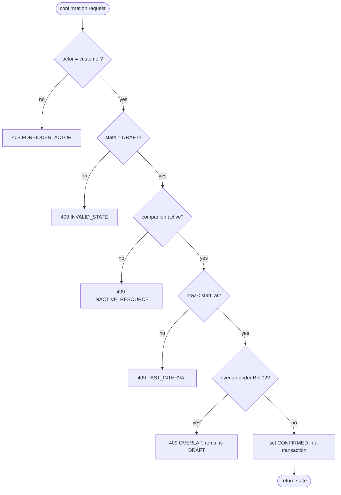
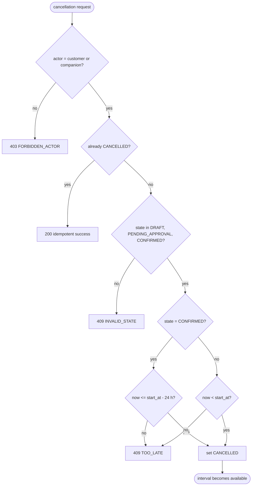
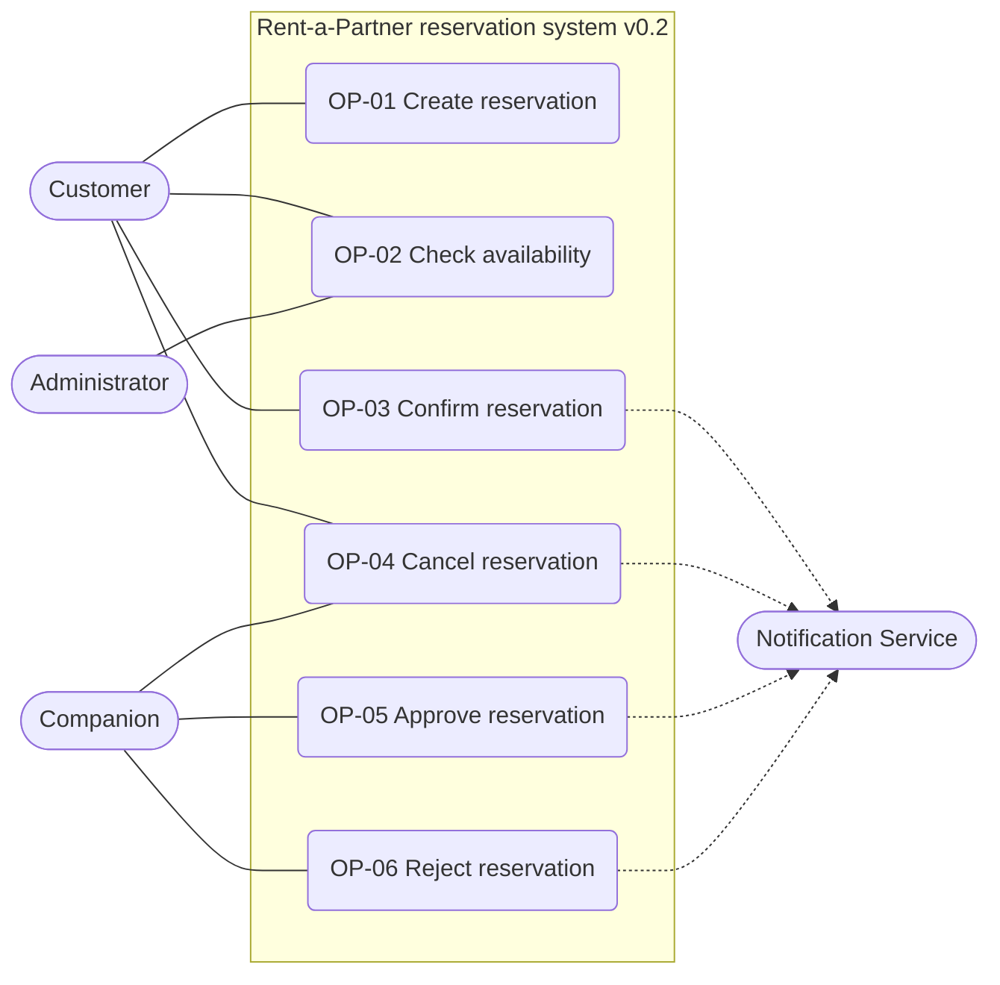
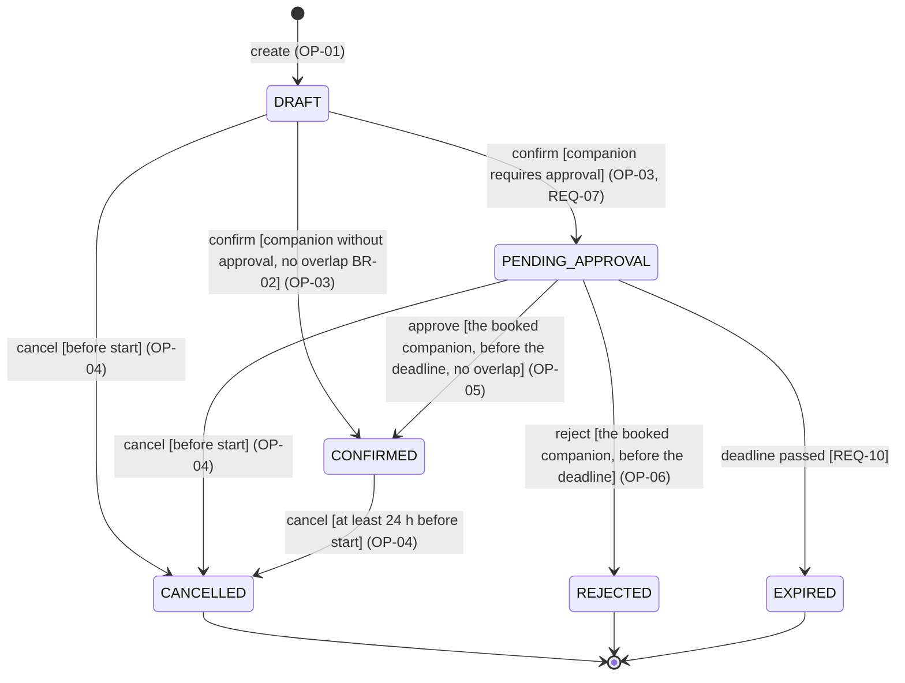
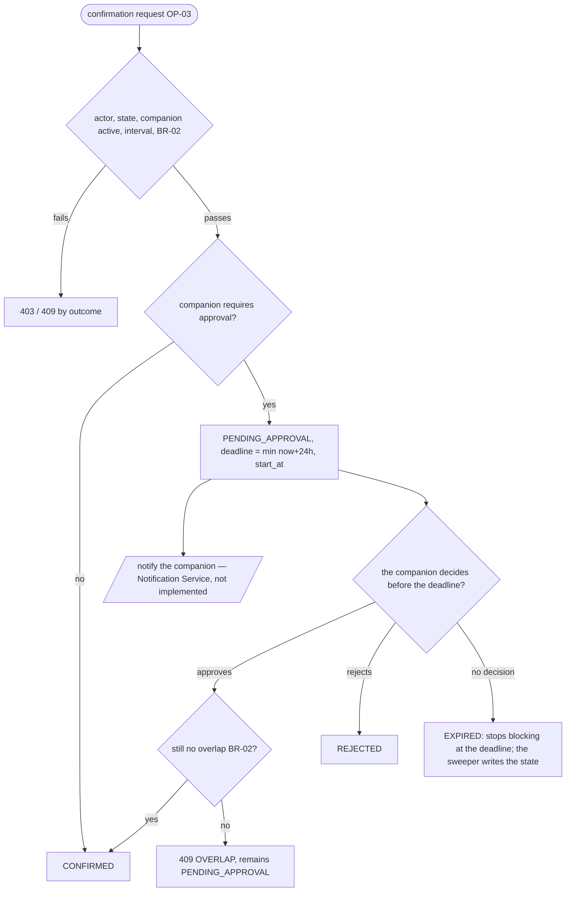

# Specification — Rent-a-Partner reservation system

**Status:** Baseline **v0.2** (baseline v0.1 approved first, then updated by change C02).
Team: Rent-a-Partner (Pavel Marszalek, Tobias Janča). Repository: `SWI-Projekt`.

## How to read this document
- **BR-xx** are domain rules and invariants. They are defined **once** in *Domain rules* and only referenced from the operations.
- **REQ-xx** are observable requirements. Each belongs to one operation and is verifiable by a concrete result.
- **OP-xx** are operations. OP-01 … OP-04 form baseline v0.1; OP-05 and OP-06 were added by change C02 (baseline v0.2).
- Everything marked *(v0.2)* did not exist in v0.1. The change impact is described in *C02 change impact*.
- Times are ISO-8601 with an offset; the system stores and compares them in UTC (BR-05).

## Actors and system boundary
| Actor | Role |
|---|---|
| **Customer** | Creates reservations, confirms them, cancels their own. |
| **Companion** | The reserved resource — a person with their own user account. Cancels reservations of their own time; *(v0.2)* approves or rejects requests. |
| **Administrator** | Manages companion profiles (`is_active`, `requires_approval`). Outside the four core operations. |
| **Notification Service** | External supporting actor. The system notifies the companion of a request awaiting approval and the customer of the result. Not implemented (see `architecture-and-decisions.md`). |

## Domain rules and invariants

**BR-01 — Interval semantics.**
A reservation interval is half-open `[start_at, end_at)`, `start_at < end_at`. Two intervals overlap when `a.start < b.end AND a.end > b.start`. Touching intervals (`[10:00,11:00)` and `[11:00,12:00)`) therefore do **not** overlap.

**BR-02 — Exclusive companion invariant.**
A companion is an exclusive resource: in no committed state of the system may two *blocking* reservations of the same companion overlap.
- v0.1: blocking states = {`CONFIRMED`}.
- *(v0.2)* blocking states = {`CONFIRMED`, `PENDING_APPROVAL` whose `approval_deadline` has not passed}.

**BR-03 — Cancellation policy.**
- `DRAFT` and *(v0.2)* `PENDING_APPROVAL` may be cancelled any time before `start_at`.
- `CONFIRMED` may be cancelled only **at least 24 h before `start_at`** — the companion has the slot blocked and needs notice.
- Cancelling an already `CANCELLED` reservation is an idempotent success (no new state change).
- `REJECTED` and *(v0.2)* `EXPIRED` are terminal; they cannot be cancelled.
- Cancellation never deletes data; it only changes the state.

**BR-04 — Approval of the booked companion** *(v0.2, the domain-specific rule from C01)*.
For a companion with `requires_approval = true`, a reservation may reach `CONFIRMED` only after that companion explicitly approves it. Neither the customer nor the system may approve on their behalf. Companions with `requires_approval = false` are confirmed directly — this is why the rule was **relaxed in v0.1** (see *C02 change impact*).

**BR-05 — Time source.**
The only source of time is the server clock (`timezone.now()`, UTC). All boundaries ("before start", "24 h before start", "deadline passed") are evaluated against it, so they are verifiable and independent of the client's clock or timezone.

**BR-06 — Actor identification.**
Every state-changing operation carries `actor_user_id` in the request body. The system compares it against the reservation's customer or the booked companion's user. **TBD:** this is a temporary stand-in for authentication (decision D6/D7); a real identity from a session or token is an architectural driver for C03.

## Reservation states
| State | Meaning | Blocks the companion (BR-02) | Terminal |
|---|---|---|---|
| `DRAFT` | A recorded intent. No allocation of the companion. | no | no |
| `PENDING_APPROVAL` *(v0.2)* | Confirmation requested, waiting for the companion's decision until `approval_deadline`. | yes, while the deadline is live | no |
| `CONFIRMED` | An accepted allocation of the companion for the interval. | yes | no |
| `CANCELLED` | Withdrawn under BR-03. | no | yes |
| `REJECTED` *(v0.2)* | The companion refused the request. | no | yes |
| `EXPIRED` *(v0.2)* | The companion did not decide before the deadline. | no | yes |

---

# Baseline v0.1

## OP-01 — Create Reservation

**Goal / user value:** The customer records the intent to book a companion for a specific interval; the reservation can be confirmed later.

**Trigger:** The customer submits a companion, an interval and an activity.

**Observable requirement:**
- **REQ-01:** For an existing, active companion and a valid interval the system shall create a reservation in state `DRAFT`, return its identifier, and allocate nothing.

**Preconditions:** the companion exists and is `is_active`; the customer exists; `start_at < end_at` (BR-01); `start_at` is in the future (BR-05); the customer is not the booked companion.

**Success postcondition:** exactly one new reservation exists; `status = DRAFT`; no allocation of the companion is committed; availability of the companion is unchanged.

**State change:** `[initial] → DRAFT`

**Referenced rules:** BR-01, BR-05.

**Main success scenario:**
1. The customer submits `companion_id`, `customer_id`, `start_at`, `end_at`, `activity`.
2. The system validates the participants, the interval and the activity.
3. The system creates the reservation in `DRAFT`.
4. The system returns the identifier (UUID) and the state.

**Alternative / failure outcomes:** unknown or inactive companion → reject, nothing created; unknown customer → reject; `end_at <= start_at` → reject; `start_at` in the past → reject; unknown activity → reject; a companion booking themselves → reject.

**Verification examples:**
| Input | Expected result |
|---|---|
| active companion, `[+7d 16:00, +7d 18:00)`, `DINNER` | `201`, one `DRAFT`, UUID returned |
| `end_at == start_at` | `400`, nothing created |
| `start_at` in the past | `400` |
| unknown / inactive companion | `400` |
| `activity = "KARAOKE"` | `400` |

**Rationale:** Creation records intent without blocking the companion, so a customer can prepare several options. An overlap is therefore **deliberately not checked here** — a `DRAFT` allocates nothing (BR-02). The collision is resolved at confirmation (OP-03).

## OP-02 — Check Availability

**Goal / user value:** Before confirming, the customer can find out whether the companion is free for the interval.

**Trigger:** Anyone asks about a companion and an interval.

**Observable requirement:**
- **REQ-02:** For a valid interval the system shall report the companion as unavailable if the interval overlaps any blocking reservation of that companion (BR-02), or if the companion is not active; otherwise it shall report available. The query changes no state.

**Preconditions:** the companion exists; the interval is valid (BR-01).

**Success postcondition:** the result is returned together with the identifiers of the blocking reservations; no reservation changes state.

**State change:** none.

**Referenced rules:** BR-01, BR-02, BR-05.

**Main success scenario:**
1. The client asks about `companion_id` and the interval `[start_at, end_at)`.
2. The system validates the interval.
3. The system finds blocking reservations of the companion overlapping the interval.
4. The system returns `available` plus the list of blocking reservations.

**Alternative / failure outcomes:** unknown companion → `404`; invalid interval → `400`; inactive companion → `available = false` with `companion_active = false`.

**Verification examples** (existing `CONFIRMED` `[10:00,11:00)`):
| Query | Expected result |
|---|---|
| `[09:00,10:00)` | `AVAILABLE` (touching, BR-01) |
| `[11:00,12:00)` | `AVAILABLE` (touching, BR-01) |
| `[10:30,11:30)` | `UNAVAILABLE`, the blocking reservation is listed |
| interval overlapping a `DRAFT` only | `AVAILABLE` |
| interval overlapping a `CANCELLED` only | `AVAILABLE` |
| inactive companion | `UNAVAILABLE` |

**Rationale:** Availability is a read-only decision aid. Its meaning is derived from BR-02 in one place, so availability and confirmation cannot disagree about which states block.

## OP-03 — Confirm Reservation

**Goal / user value:** A valid draft becomes an accepted allocation of the companion.

**Trigger:** The customer requests confirmation of their reservation.

**Observable requirements:**
- **REQ-03:** The system shall confirm a `DRAFT` reservation only when the actor is the reservation's customer, the companion is active, the interval has not started, and the interval does not overlap a blocking reservation of the same companion (BR-02).
- **REQ-04:** For competing confirmations that would violate BR-02, at most one reservation shall reach `CONFIRMED`; the others shall be rejected with the outcome `OVERLAP` and remain `DRAFT`.

**Preconditions:** the reservation exists; `status = DRAFT`; the actor is the customer (BR-06); the companion is `is_active`; `now < start_at` (BR-05).

**Success postcondition:** `status = CONFIRMED`; the reservation blocks the companion for its interval (BR-02); OP-02 reports the interval as unavailable.

**State change:** `DRAFT → CONFIRMED`

**Referenced rules:** BR-01, BR-02, BR-05, BR-06.

**Main success scenario:**
1. The customer requests confirmation of the reservation.
2. The system verifies the actor, the state, the companion and the interval.
3. The system verifies there is no overlap with a blocking reservation (BR-02).
4. The system sets `CONFIRMED` and returns the state.

**Alternative / failure outcomes:** a different actor → `403 FORBIDDEN_ACTOR`, state unchanged; a state other than `DRAFT` → `409 INVALID_STATE`; inactive companion → `409 INACTIVE_RESOURCE`, remains `DRAFT`; the interval has started → `409 PAST_INTERVAL`; overlap → `409 OVERLAP`, remains `DRAFT`.

**Verification examples:**
| Situation | Expected result |
|---|---|
| `DRAFT`, active companion, no overlap | `CONFIRMED` |
| two overlapping drafts, confirmed one after the other | the first `CONFIRMED`, the second `409 OVERLAP` and still `DRAFT` |
| two touching drafts `[10,11)` and `[11,12)` | both `CONFIRMED` (BR-01) |
| confirmation by a stranger | `403`, remains `DRAFT` |
| already `CONFIRMED` | `409 INVALID_STATE` |
| companion deactivated after creation | `409 INACTIVE_RESOURCE` |
| `start_at` already passed | `409 PAST_INTERVAL` |

**Rationale:** Confirmation is the moment the allocation arises, so this is where BR-02 must hold. The check and the state change happen in one transaction with the overlap re-checked inside it.

**TBD / assumption:** Under a genuinely parallel load, REQ-04 depends on the database's isolation. SQLite (D3) does not support row locking, so we verify the requirement sequentially; a parallel test needs PostgreSQL — an architectural driver for C03.

## OP-04 — Cancel Reservation

**Goal / user value:** An unwanted reservation can be withdrawn and stops blocking the companion.

**Trigger:** The customer or the booked companion asks to cancel.

**Observable requirements:**
- **REQ-05:** The system shall allow cancellation under BR-03; after a successful cancellation `status = CANCELLED` and the reservation no longer blocks the companion's availability.
- **REQ-06:** Cancelling an already `CANCELLED` reservation shall be an idempotent success without a further state change.

**Preconditions:** the reservation exists; the actor is the customer or the booked companion's user (BR-06); the state and the time boundary satisfy BR-03.

**Success postcondition:** `status = CANCELLED`; OP-02 reports the interval as available again; data is preserved.

**State change:** `DRAFT → CANCELLED`, `CONFIRMED → CANCELLED`, *(v0.2)* `PENDING_APPROVAL → CANCELLED`

**Referenced rules:** BR-03, BR-05, BR-06.

**Main success scenario:**
1. The actor asks to cancel the reservation.
2. The system verifies the actor and the state.
3. The system verifies the time boundary under BR-03.
4. The system sets `CANCELLED` and returns the state.

**Alternative / failure outcomes:** a stranger → `403 FORBIDDEN_ACTOR`; `CONFIRMED` less than 24 h before the start → `409 TOO_LATE`, remains `CONFIRMED`; `DRAFT` after the start → `409 TOO_LATE`; `REJECTED` / `EXPIRED` → `409 INVALID_STATE`; already `CANCELLED` → `200` with `idempotent: true`.

**Verification examples:**
| Situation | Expected result |
|---|---|
| `DRAFT` before the start | `CANCELLED` |
| `CONFIRMED`, start in 7 days | `CANCELLED`, the interval becomes available |
| `CONFIRMED`, start in 24 h 1 min | `CANCELLED` (just outside the boundary) |
| `CONFIRMED`, start in 23 h 59 min | `409 TOO_LATE`, remains `CONFIRMED` |
| `DRAFT`, start 5 min ago | `409 TOO_LATE` |
| cancellation by the companion | `CANCELLED` |
| second cancellation | `200`, `idempotent: true` |

**Rationale:** The 24 h notice for a confirmed reservation comes from the domain: the companion has the time blocked and has usually declined other offers. A draft blocks nothing, so it can be dropped until the start.

---

## Requirement acceptance check
Every requirement went through the team review. Summary of the answers:

| REQ | Meaning | Need | Observable | Verifiable by | State / time / concurrency |
|---|---|---|---|---|---|
| REQ-01 | "valid interval" = BR-01, "active" = `is_active` | records intent without blocking | outcome: reservation in `DRAFT` | HTTP `201` + a row in the DB | depends on `now` (start in the future) |
| REQ-02 | "unavailable" = overlaps a blocking state | the customer needs to know before confirming | outcome: `available` + the blocking ids | availability examples incl. touching intervals | read-only; result depends on `now` for pending *(v0.2)* |
| REQ-03 | "does not conflict" = BR-02 | this is where the allocation arises | outcome: `CONFIRMED` / `409 OVERLAP` | confirmation examples | boundary `now < start_at`; concurrency → REQ-04 |
| REQ-04 | "at most one" is a business outcome, not a lock | double-booking is the worst failure of the domain | outcome: exactly one `CONFIRMED` | two attempts in sequence; parallel is a TBD (D3) | concurrency is the whole point of the requirement |
| REQ-05 | "24 h before the start" against the server clock (BR-05) | the companion needs notice | outcome: `CANCELLED` / `409 TOO_LATE` | the 23 h 59 / 24 h 01 boundary | purely a time boundary |
| REQ-06 | idempotency = the same result, no new change | retries and double clicks | outcome: `200` + `idempotent` | second cancellation | order-independent |
| REQ-07 *(v0.2)* | deadline = `min(now + 24 h, start_at)` | a request cannot hang forever | outcome: `PENDING_APPROVAL` + deadline | a companion with `requires_approval` | the deadline is data, computed from `now` |
| REQ-08 *(v0.2)* | pending blocks while the deadline is live | the team chose not to promise the slot twice | outcome: `available = false` | availability before and after the deadline | the result changes with time even without a write |
| REQ-09 *(v0.2)* | "only the booked companion" = `Companion.user` | BR-04, the C01 domain rule | outcome: `CONFIRMED` / `REJECTED` / `403` | a decision by the wrong actor | re-checks BR-02 at the decision |
| REQ-10 *(v0.2)* | "did not decide" = `approval_deadline <= now` | the C01 assumption: a response within 24 h | outcome: `EXPIRED`, the slot is free | approval after the deadline + the sweeper command | the boundary is the deadline itself |

The table answers *meaning, need, observable result, verifiability* and *state / time / concurrency*. The remaining three questions of the acceptance check are answered elsewhere and are not repeated per requirement: **feasibility** — every requirement has a verification example that the running application actually passes (see `evidence-and-evolution.md`); **consistency** — the two *Consistency check* tables below; **uncertainty** — the paragraph that follows plus the explicit TBDs in OP-03 and BR-06.

**Uncertainty:** the 24 h approval window and the 24 h cancellation notice are **team-chosen values** derived from the C01 assumption ("companions respond within 24 h"). They have no external source, they are declared as configurable constants, and they are the first thing to revisit when real data arrives.

## Diagrams — baseline v0.1

### Use-case view

### Reservation lifecycle

### Activity — Create reservation (OP-01)

### Activity — Check availability (OP-02)

### Activity — Confirm reservation (OP-03)

### Activity — Cancel reservation (OP-04)

## Consistency check
| Check | Result |
|---|---|
| Create vs. Confirm | Consistent: `DRAFT` allocates nothing, so Create does not check overlap; the allocation arises only at Confirm (stated in OP-01 *Rationale*). |
| Availability vs. Confirm | Consistent: both derive "blocking" from BR-02 alone, and the code uses a single helper `blocking_reservations()` for both. |
| Cancel vs. state diagram | Consistent: the diagram contains `DRAFT → CANCELLED` and `CONFIRMED → CANCELLED` with the BR-03 guards that the text uses. |
| Interval semantics | Consistent: BR-01 `[start,end)` and the verification examples for touching intervals `[10,11)` / `[11,12)` in OP-02 and OP-03. |
| Use-case view vs. text | Consistent: all four goals have a specified behaviour; the Administrator's only baseline goal is the read-only OP-02 (its trigger is "anyone"), profile management lies outside the four operations; the Notification Service is only a supporting actor. |
| Requirement vs. design decision | No requirement names a technology. SQLite, Django and UUIDs live in `architecture-and-decisions.md`, not in REQ-xx. |
| Uncertainty vs. invented precision | The 24 h windows are declared as team-chosen values with a source in the C01 assumption; the parallel-confirmation limit is an explicit TBD. |

## Baseline v0.1 — team approval
Baseline v0.1 was written and approved by **Pavel Marszalek** on **2026-09-21** as the starting state of the running application. Change C02 was analysed and applied on top of it in the same working session, so both baselines reached the repository in a single commit (PR #3) — the document records the order of the work, not a separate commit per baseline.

**Tobias Janča** reviewed this specification and confirmed baseline v0.1 on **2026-09-21**. That review produced the corrections recorded in [evidence-and-evolution.md](evidence-and-evolution.md): the OP-06 verification examples that were specified but never run, the missing parts of the OP-06 operation template, and the activity diagrams for OP-01 and OP-02.

---

# C02 change impact

**Changed condition:** Some companions require approval by an authorised person (the companion themselves) before a reservation can become `CONFIRMED`. The approval can be delayed, refused, or expire.

**Affected requirements / parts of the specification:**
- **BR-02** — the set of blocking states grows to include `PENDING_APPROVAL` with a live deadline (a team decision: we do not promise the same slot twice).
- **BR-04** — the C01 rule, relaxed in v0.1, comes back into force for companions with `requires_approval = true`.
- **OP-03 Confirm** — splits into a *request* and a *decision*. For a companion without approval it stays a single immediate step; with approval it ends in `PENDING_APPROVAL` (new REQ-07).
- **OP-02 Check Availability** — REQ-02 is unchanged in wording ("overlaps a blocking reservation"), but its result changes because BR-02 changed (new REQ-08).
- **OP-04 Cancel** — BR-03 gains `PENDING_APPROVAL` among the cancellable states; the boundary and the policy for `CONFIRMED` do not change.
- **Reservation states** — new `PENDING_APPROVAL`, `REJECTED`, `EXPIRED`.

**Unaffected requirements / parts and why:**
- **OP-01 Create / REQ-01** — unchanged. Creation still records only intent; the approval process starts at confirmation, so Create has no reason to know about it.
- **REQ-04** (at most one confirmation) — unchanged in meaning; it just now also applies to the request step, because a pending request blocks too.
- **REQ-05, REQ-06** (the cancellation boundary and idempotency) — unchanged.
- **BR-01** interval semantics and **BR-05** time source — unchanged.
- **Administrator** — no new goal; they only set `requires_approval` on the profile.

**New actor / operation:** no new actor — the Companion already existed as an actor for Cancel. Two new goals appear for them: **OP-05 Approve** and **OP-06 Reject**.

**Changed rules / meaning of states:** `CONFIRMED` now means "accepted, if approval was required then by the companion". `PENDING_APPROVAL` is a new *blocking but not yet accepted* state — the first state whose blocking effect ends with the passage of time rather than a user action.

**Use-case view change:** the Companion gains a link to OP-05 and OP-06; the Notification Service gains the "request awaiting approval" notification. Nothing is removed.

**State diagram change:** a second branch out of `DRAFT` (to `PENDING_APPROVAL`), and out of it to `CONFIRMED`, `REJECTED`, `EXPIRED` and `CANCELLED`.

**New verification examples:** see OP-05 and OP-06, in particular approval after the deadline, a decision by the wrong actor, availability before and after the deadline, and the sweeper command.

**Architectural drivers for C03:** see the end of this document and `architecture-and-decisions.md`.

---

# Baseline v0.2 — the approval process

## OP-05 — Approve Reservation *(new)*

**Goal / user value:** The booked companion decides about their own time; only their approval turns a request into a confirmed allocation.

**Trigger:** The companion approves a request that is awaiting their decision.

**Observable requirements:**
- **REQ-07:** For a companion with `requires_approval = true`, a confirmation (OP-03) shall put the reservation into `PENDING_APPROVAL` and set `approval_deadline = min(now + 24 h, start_at)`.
- **REQ-08:** A `PENDING_APPROVAL` reservation whose deadline has not passed shall block the companion's availability (BR-02).
- **REQ-09:** Only the booked companion's user may approve a request. On approval the system shall re-check BR-02 and set `CONFIRMED`.
- **REQ-10:** After `approval_deadline` the request shall not be approvable; such a reservation counts as `EXPIRED` and stops blocking the companion.

**Preconditions:** the reservation exists; `status = PENDING_APPROVAL`; the actor is `Companion.user` (BR-04, BR-06); `now < approval_deadline`.

**Success postcondition:** `status = CONFIRMED`; `decided_by` = the deciding companion's user; the reservation blocks the companion (BR-02).

**State change:** `DRAFT → PENDING_APPROVAL` (OP-03 with approval) and `PENDING_APPROVAL → CONFIRMED`

**Referenced rules:** BR-01, BR-02, BR-04, BR-05, BR-06.

**Main success scenario:**
1. The customer requests confirmation; the system finds `requires_approval` and records `PENDING_APPROVAL` with a deadline.
2. The companion is notified (Notification Service, not implemented).
3. The companion approves the request before the deadline.
4. The system re-checks BR-02 and sets `CONFIRMED`.

**Alternative / failure outcomes:** the customer or a stranger decides → `403 FORBIDDEN_ACTOR`, remains `PENDING_APPROVAL`; a state other than `PENDING_APPROVAL` → `409 INVALID_STATE`; approval after the deadline → `409 EXPIRED` and the reservation is recorded as `EXPIRED`; meanwhile another reservation took the slot → `409 OVERLAP`, remains `PENDING_APPROVAL` (the companion can still cancel or reject it).

**Verification examples:**
| Situation | Expected result |
|---|---|
| confirmation for a companion with `requires_approval` | `PENDING_APPROVAL`, `approval_deadline = now + 24 h` |
| the start is in 3 h | `approval_deadline = start_at` (the window never crosses the start) |
| approval by the booked companion | `CONFIRMED`, `decided_by` set |
| approval by the customer | `403`, remains `PENDING_APPROVAL` |
| approval 1 s after the deadline | `409 EXPIRED`, state `EXPIRED` |
| approval when another `CONFIRMED` covers the interval | `409 OVERLAP` |
| availability of the interval while pending is live | `UNAVAILABLE` |
| availability of the same interval after the deadline | `AVAILABLE` |

**Rationale:** BR-04 is the domain-specific rule from C01 — the companion is a person, not equipment, so nobody may allocate their time for them.

**Design note:** `approval_deadline` is stored **data**, and availability treats a pending reservation as blocking only while the deadline is live. So expiry is correct even if no background process has run. The `expire_pending_approvals` command only materialises the `EXPIRED` state (for reporting and for the customer's view).

## OP-06 — Reject Reservation *(new)*

**Goal / user value:** The companion can refuse a request, and the slot is immediately free for others.

**Trigger:** The companion rejects a request awaiting their decision.

**Observable requirement:** part of **REQ-09** — only the booked companion may decide; on rejection the system shall set `REJECTED`.

**Preconditions:** as OP-05 (`PENDING_APPROVAL`, the booked companion, before the deadline).

**Success postcondition:** `status = REJECTED`; `decided_by` is set; the reservation stops blocking the companion; the state is terminal (BR-03).

**State change:** `PENDING_APPROVAL → REJECTED`

**Referenced rules:** BR-02, BR-03, BR-04, BR-05, BR-06.

**Main success scenario:**
1. The companion opens a request that is awaiting their decision.
2. The system verifies the actor (BR-04, BR-06), the state and the deadline (BR-05).
3. The system sets `REJECTED` and records `decided_by`.
4. The reservation stops blocking the companion (BR-02) and the system returns the state.

**Alternative / failure outcomes:** the same as OP-05 except the overlap check, which a rejection does not need.

**Verification examples:**
| Situation | Expected result |
|---|---|
| rejection by the booked companion | `REJECTED`, the interval becomes available |
| rejection by the customer | `403` |
| rejection of a `DRAFT` | `409 INVALID_STATE` |

**Rationale:** A rejection is a legitimate outcome of the process, and it must be distinguishable from a cancellation by the customer (`CANCELLED`) and from silence (`EXPIRED`) — the three have different domain meanings even though none of them blocks.

## Diagrams — baseline v0.2

### Use-case view (v0.2)

### Reservation lifecycle (v0.2)

### Activity — the approval process (OP-03 + OP-05 / OP-06)

## Consistency check (v0.2)
| Check | Result |
|---|---|
| BR-02 vs. OP-02 vs. OP-03 vs. OP-05 | Consistent: all three use the same definition of a blocking reservation, implemented once in `blocking_reservations()`. |
| Availability vs. the deadline | Consistent: a pending reservation stops blocking at the moment of the deadline, independently of whether the sweeper has run. |
| Cancel vs. the state diagram (v0.2) | Consistent: `PENDING_APPROVAL → CANCELLED` is in BR-03, in OP-04 and in the diagram; `REJECTED` and `EXPIRED` are terminal in all three places. |
| OP-03 vs. BR-04 | Consistent: a direct `DRAFT → CONFIRMED` exists only for `requires_approval = false`; the diagram shows both branches with a guard. |
| Use-case view vs. new operations | Consistent: OP-05 and OP-06 belong to the Companion, who was already an actor. |
| Expiry vs. invented precision | The 24 h window is a declared team value from the C01 assumption, not an AI-invented timeout. |

## Architectural drivers for C03
1. **Concurrency around BR-02.** REQ-04 and REQ-09 are business outcomes that depend on isolation. SQLite cannot lock rows, so a real guarantee needs PostgreSQL plus `select_for_update` or a DB-level exclusion constraint.
2. **A time-driven process.** `EXPIRED` is the first state change with no user behind it. Today it is a `manage.py` command that somebody has to run; it needs a scheduler or an evaluation at read time — and the two must not disagree.
3. **The notification boundary.** Four operations now want to notify (request, approval, rejection, cancellation), and a notification failure must not roll back the state change. This calls for an interface with a stub plus a retry policy.
4. **Rules inside views.** The BR-02, BR-03 and BR-04 checks sit in `views.py` next to HTTP handling, and the actor rules are repeated in four places. This is the target for C03's restructuring: a domain layer where a state transition is one function.
5. **Identity of the actor.** `actor_user_id` in the body (BR-06, D7) is a stand-in. Real authentication changes every state-changing operation, so it belongs in the C03 design.
